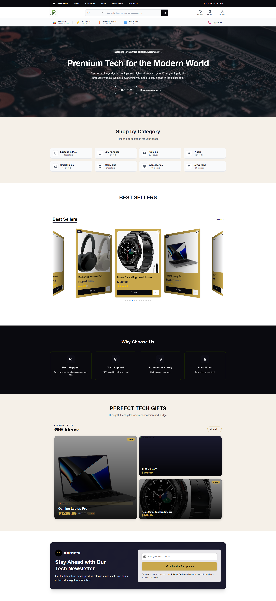
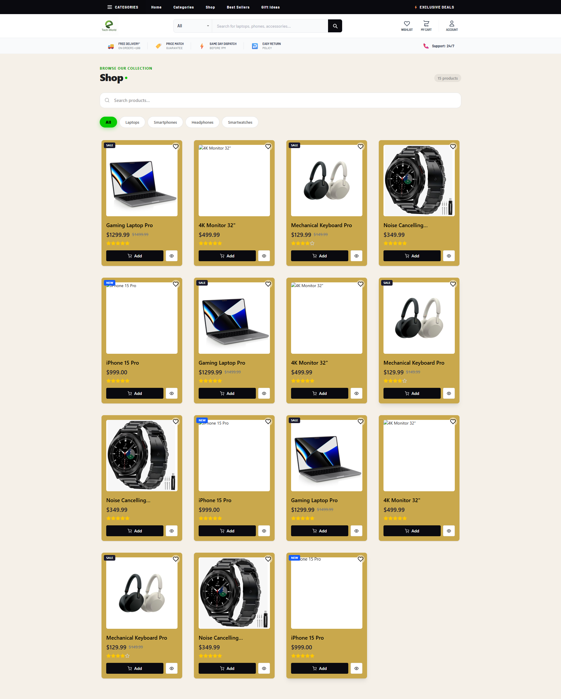

A high-performance, responsive React e-commerce application built for the modern digital age. This project follows a Lead Director architectural pattern, focusing on decoupled logic, atomic UI components, and a professional-grade tech stack.

## 🚀 Technical Transformation Summary

The project has undergone a significant architectural overhaul to ensure production-level reliability and scalability:

- **Data Unification**: Eliminated "split-brain" data issues by consolidating all products into a single source of truth (`src/data/products.js`) with a standardized schema.
- **Atomic UI**: Developed a reusable `ProductCard.jsx` component, removing redundant code and ensuring visual parity across the "Shop," "Bestsellers," and "Gift Ideas" sections.
- **Headless Logic**: Extracted complex carousel math and touch gestures into a reusable `useCarousel` hook, separating presentation from logic.
- **Dynamic Navigation**: Implemented a modern two-row Navbar architecture integrated with Redux state and React Router for seamless navigation.

## 🛠️ Tech Stack

- **Frontend**: React 19, Vite
- **Styling**: Tailwind CSS 4, Google Fonts (Barlow)
- **State Management**: Redux Toolkit (Cart & Wishlist logic)
- **Routing**: React Router DOM
- **Icons**: React Icons

## 📸 Captures

### Home Page

*Refactored with "Zebra Styling" and optimized visual hierarchy.*

### Shop Experience

*Dynamic product grid powered by the `useProducts` hook.*

### Responsive Navigation

*Integrated with Redux to show real-time cart and wishlist counts.*

## 🏗️ Project Architecture

```text
src/
├── app/              # Redux Store configuration
├── assets/           # Media and branding assets
├── components/       # Atomic UI (ProductCard, Navbar, etc.)
├── data/             # Unified product schema (Source of Truth)
├── features/         # Redux Slices (Cart, Wishlist)
├── hooks/            # Headless Logic (useProducts, useCarousel)
└── pages/            # Core views (HomePage, Shop, Cart, Wishlist)# Content for the README.

